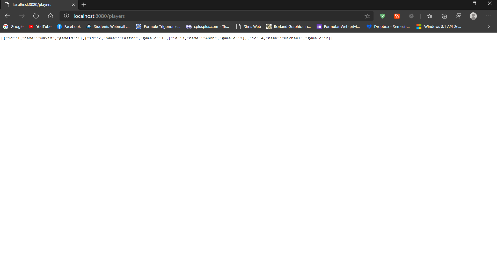
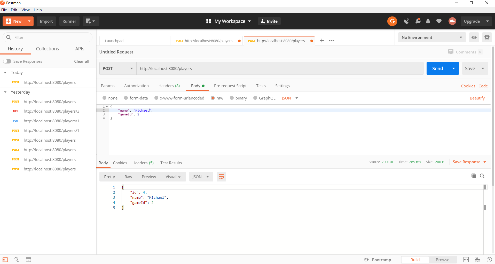
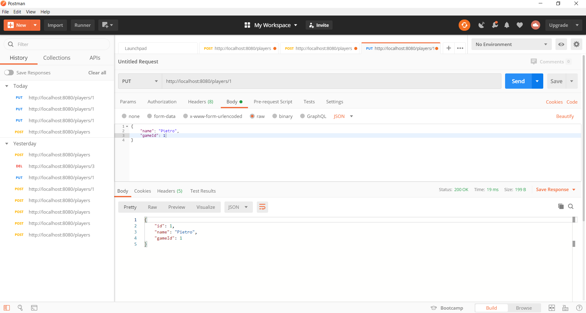

# Lab 10's Assignment - Notes:

1. All classes contain code for the Compulsory section;
2. All classes have javadoc and explanatory comments;
3. The project was built as a Maven project, therefore all dependencies can be found in the `pom.xml` file;
5. The application's settings can be found in the `application.properties` file;
4. The following pictures showcase how the application works.

