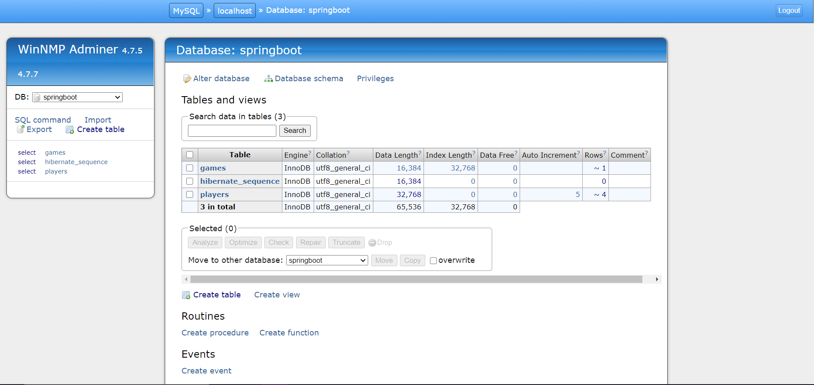

# Lab 11's Assignment - Notes:

1. The classes contain code for the Compulsory and Optional sections (all classes from `player` directory and Lab11Application class - Compulsory; all classes from `config`, `exception` and `game` directories - Optional);
2. All classes have javadoc and explanatory comments;
3. The project was built as a Maven project, therefore all dependencies can be found in the `pom.xml` file;
4. The application's settings can be found in the `application.properties` file;
5. The classes from `config` are for the communication's securing, those from `game` are for the Rest services directed towards games and those from `exception` are for the exception handling;
6. The following pictures showcase how the application works.

<table>
  <tr>
    <td>Browser GET All Players</td>
     <td>Browser GET Players</td>
     <td>Postman POST Players</td>
  </tr>
  <tr>
    <td></td>
    <td></td>
    <td></td>
  </tr>
 </table>
 
 <table>
  <tr>
    <td>Postman PUT Players</td>
     <td>Postman DELETE Players</td>
     <td>Project Database</td>
  </tr>
  <tr>
    <td></td>
    <td></td>
    <td></td>
  </tr>
 </table>

<table>
  <tr>
    <td>Postman GET All Games</td>
     <td>Postman POST Games</td>
     <td>Error Handling with RestControllerAdvice</td>
  </tr>
  <tr>
    <td></td>
    <td></td>
    <td></td>
  </tr>
 </table>
