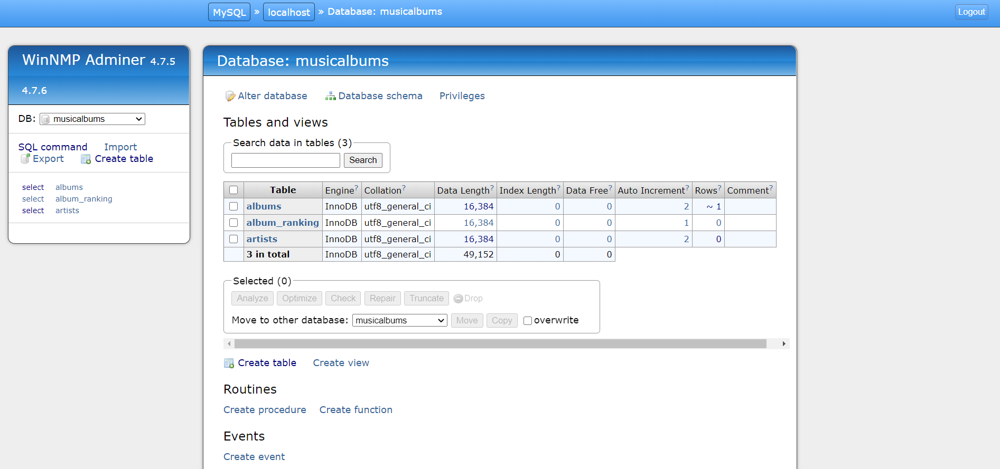
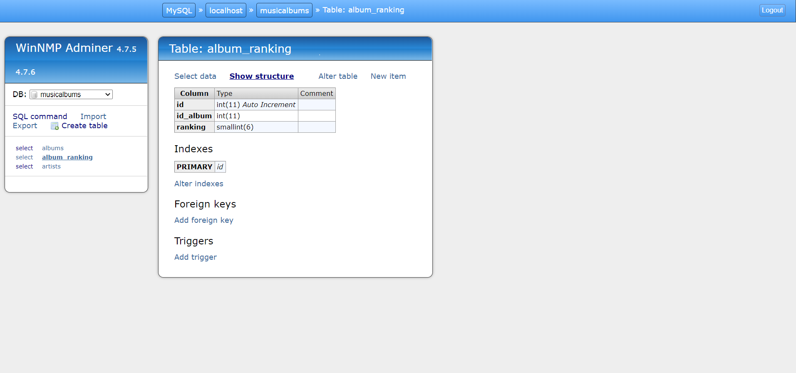
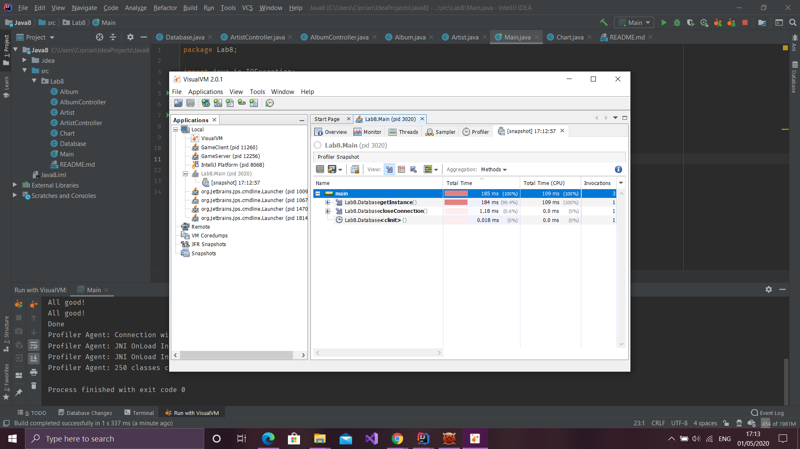

# Lab 8's Assignment - Notes

1. I made a change regarding the connection to the database in Database class. Now it should work;
2. All classes contain code for the Compulsory section (The only things done for the Optional are the creation of a table for charts and the restructuring, and from Bonus only the VisualVm point - although without the rest of the other points. I've enclosed some images in the readme for the said points).

